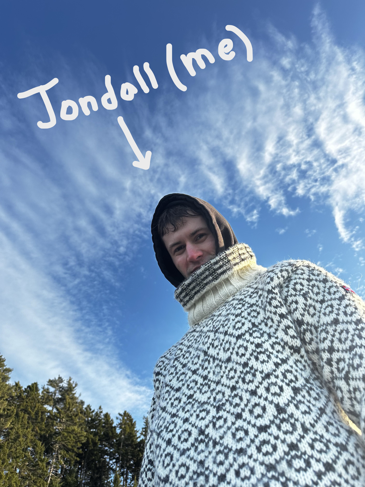

<figure>
    
    <figcaption><i>at schiller csc</i></figcaption>
</figure>

I am an aspiring ocean professional with an interest in physical oceanography in polar regions. I am currently employed as a hydrographic surveyor out of Connecticut, working on projects up and down the east coast. 

My passions include diners, cold weather, arts and crafts, and listening to music. 
